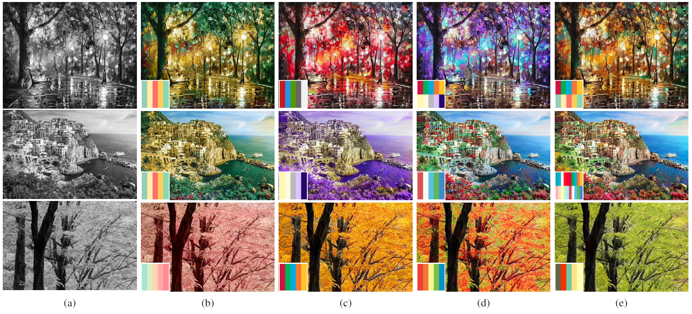

# Example-based Colorization via Dense Encoding Pyramids



**Example-based Colorization via Dense Encoding Pyramids**, Chufeng Xiao, Chu Han, Zhuming Zhang, Jing Qin, Tien-Tsin Wong, Guoqiang Han, Shengfeng He, _Computer Graphics Forum,_ 2019.

## Prerequisites

* Linux
* [Caffe](http://caffe.berkeleyvision.org/) & Pycaffe
* Python 2 or 3
* Python libraries (numpy, skimage, scipy)

## Getting Started

### Compile Caffe

* copy two files `softmax_cross_entropy_loss_layer.cpp` and `softmax_cross_entropy_loss_layer.cu` under the folder `./resources` into `<your caffe path>/caffe/src/caffe/layers/`

* copy the file `softmax_cross_entropy_loss_layer.hpp` under the folder `./resources` into `<your caffe path>/caffe/include/caffe/layers`

* Note that you also need to compile `pycaffe` and add it into  your `PYTHONPATH`:

  ```bash
  vi ~/.bashrc
  
  # add the two lines into the file
  PYTHONPATH=<you caffe path>/caffe/python:$PYTHONPATH
  LD_LIBRARY_PATH=<you caffe path>/caffe/build/lib:$LD_LIBRARY_PATH
  
  # save and update the environment
  source ~/.bashrc
  ```

* compile and test `caffe`:

  ```bash
  # execute under the root directory of caffe
  make clean # clean the files complied before
  
  make all -j8
  make test -j8
  ```

### Add Interface Files into Settings

In order to use the interface files for `caffe` layer, you need to add the path of the folder `./resources`

```bash
vi ~/.bashrc

# add this line
export PYTHONPATH=$PYTHONPATH:~/<DEPN path>/resources

# save and update the environment
source ~/.bashrc
```

### Download the Models of DEPN

There are two models you need to download for testing or training. `DEPN_init.caffemodel` saves the first-level parameters of DEPN, while `DEPN_sub.caffemodel` provides the shared parameters used by the second level and over.

```bash
wget https://drive.google.com/uc?id=1tE2FdfkvT2sJQu_VezVXqhgiNUY_yOZE&export=download -P ./models
wget https://drive.google.com/file/d/16x_Y2qSk_ewQlHlN0d1ESp1ahQcBiDY7/view?usp=sharing -P ./models
```

## Test and Generate Colorful Images

You can choose any image as a reference for the grayscale image, even a palette. Just simply execute `test.py` :

```bash
python test.py -gray <gray_dir> -refer <refer_dir> -output <output_dir>

# Example
python test.py -gray ./test_img/gray/1.jpg -refer ./test_img/refer/1.jpg -output ./test_img/result/1.png
```

Please make sure the size of the grayscale image is at least `64*64`. If you want to test the image with smaller size or want to adjust the first-level input size of DEPN, you should change the value of `init_level`in `test.py` to the size you desire. And then create a new file `DEPN_deploy_<size>.prototxt`:

* copy and paste the file `DEPN_deploy_64.prototxt` under the `./models/test/`

* change the name of the new file to `DEPN_deploy_<new_size>.prototxt`

* edit the file`DEPN_deploy_<new_size>.prototxt` and change all the values `64` of the input layer to the new size:

  ```
  layer {
    name: "img_l"
    type: "Input"
    top: "img_l"
    input_param {
      shape { dim: 1 dim: 1 dim: 64 dim: 64 }
    }
  }
  
  layer {
    name: "ref_ab"
    type: "Input"
    top: "ref_ab"
    input_param {
      shape { dim: 1 dim: 2 dim: 64 dim: 64 }
    }
  }
  ```

The procedures of changing the input size of the second level and over are similar to these.

## Training

### Prepare Dataset

You need to transform the dataset of images into LMDB files, which can be used for training through caffe.

* For the first level of DEPN, you should only prepare a LMDB file with a set of colorful images, which will be automatically divided into grayscale image, namely luminance channel, and ground truth by our codes.

* For the levels above the first, all of them not only require images with the corresponding size as datasets, like the first level, but also need the small outcomes from the former level, which means that you should generate two LMDB files. You can use the codes in `test.py` to get the small outcome at the former level.

  ```python
  ....
  
  # if you need to use the small outcome to train the higher levels, please use the codes below:
  small_img_rgb=caffe.io.resize_image(img_rgb,(size/4,size/4))
  small_img_lab = color.rgb2lab(small_img_rgb)
  small_img_l = small_img_rgb[:,:,0]
  small_img_lab_out = np.concatenate((small_img_l[:,:,np.newaxis],ab_dec),axis=2)
  small_img_rgb_out = (255*np.clip(color.lab2rgb(small_img_lab_out),0,1)).astype('uint8')
  scipy.misc.toimage(small_img_rgb_out).save(sm_out)
  
  ....
  ```

### Edit Network Prototxt

After getting the LMDB files, you should edit the network prototxt, like `./models/train/DEPN_64.prototxt` and `./models/train/DEPN_128.prototxt`, to place the path of your LMDB files as the value of `source`.

If you want to change the input size of DEPN while training, you also can change the sizes of the images in LMDBs and correspondingly replace the value of `crop_size`.

```
layer {
  name: "data"
  type: "Data"
  top: "data"
  include {    phase: TRAIN  }
  transform_param {
   mirror: true
   crop_size: 64
  }
  data_param {
    source: "" # [[REPLACE WITH YOUR PATH]]
    batch_size: 5
    backend: LMDB
  }
}

layer {
  name: "data"
  type: "Data"
  top: "data"
  include {    phase: TEST  }
  transform_param {
   mirror: true
   crop_size: 64
  }
  data_param {
    source: "" # [[REPLACE WITH YOUR PATH]]
    batch_size: 1
    backend: LMDB
  }
}
```

### Edit Training Prototxt

Before starting training, please change the `net` position, i.e., the path of network prototxts, in the file `./models/train/solver.prototxt`.

### Start Training

Execute `sh ./models/train/train_DEPN.sh` to start training. You maybe need to change the caffe position to match that in your machine. And if you want to train the network based on our models, you can set `./models/DEPN_init.caffemodel` or `./models/DEPN_sub.caffemodel` as a pre-trained model.

```
<Your install path>/caffe/build/tools/caffe train -solver ./models/train/solver.prototxt -gpu 0 -weights ./models/DEPN_init.caffemodel
```

